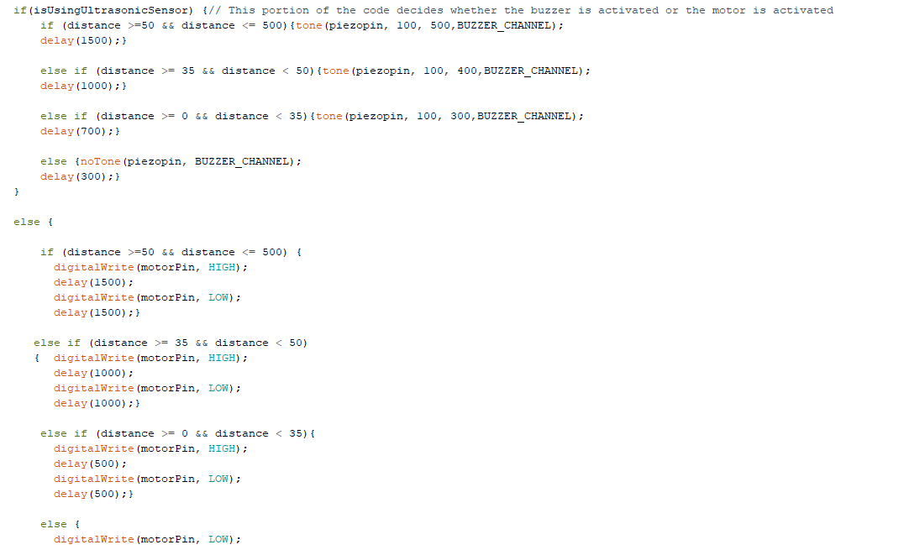
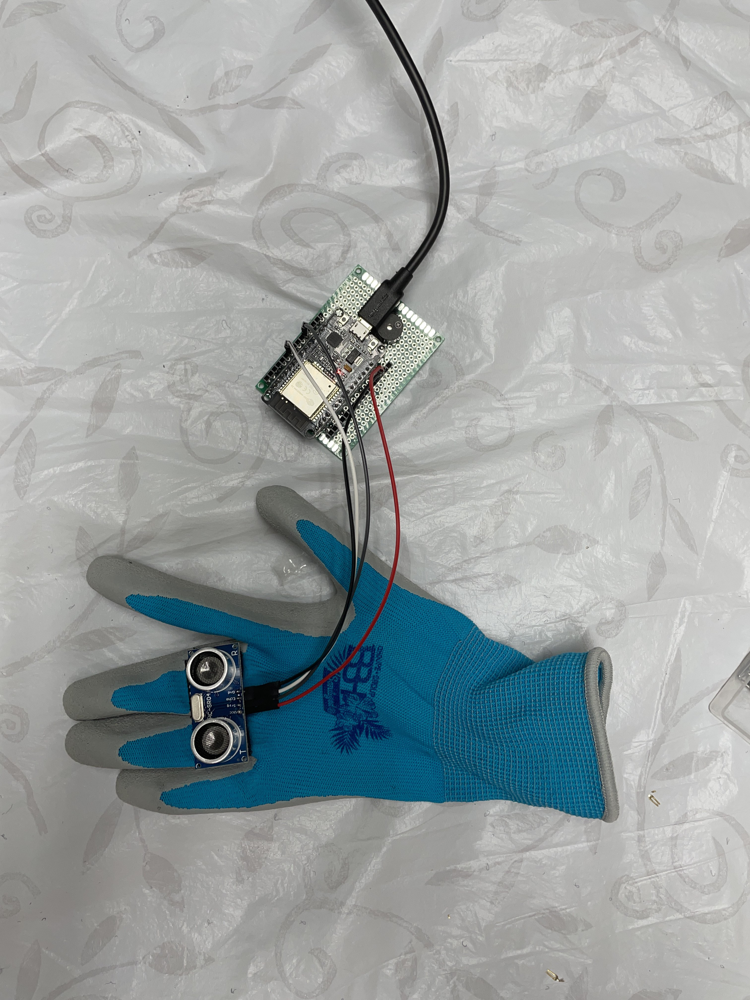
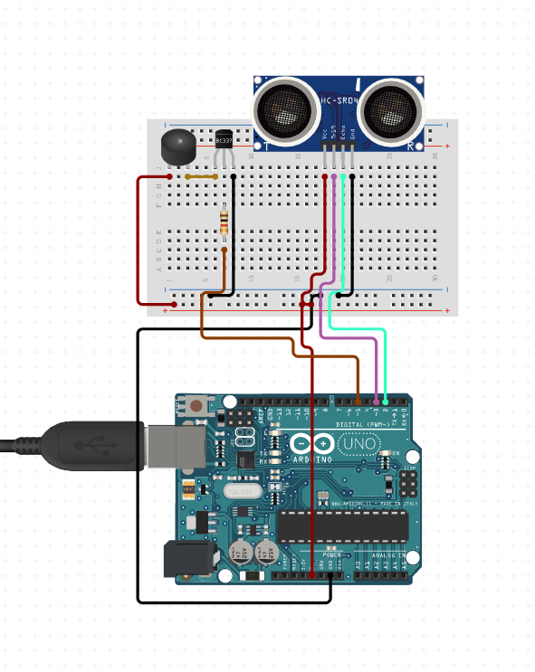
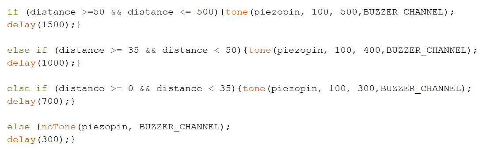

#  "Third Eye" for the Visually Impaired

| **Engineer** | **School** | **Area of Interest** | **Grade** |
|:--:|:--:|:--:|:--:|
| Sanjana Kulkarni | Middlesex County Academy for STEM | Electrical Engineering | Incoming Junior

  
# Final Milestone
For my final milestone I decided to incorporate my modifications into the base project that I had already built in my second milestone. In order to do this I incorporated a Vibrating Motor, and 2 buttons. 

<HTML>

The first button helps the user decide whether or not the glove will use the piezo buzzer or the vibrating motor as it’s output source. If the user pushes the button, the ultrasonic sensor will still read the values but the mode of the output changes. The vibrating motor was easy to connect to the ESP32. Since there are 3 pins on the vibrating motor, the pin on the very left goes to ground, the pin in the middle goes to VCC, and the pin on the very right goes to the input pin on the ESP32. The button along with the resistor, are soldered onto the perf board which makes it easily accessible for the user to push. 
</HTML>
 
 
 
 
 
<HTML>

The second modification I incorporated was the use of the second button. Although this glove will always be sensing an object, I realized that I did not have any means to completely stop the project from working. Therefore, I incorporated another button to turn this project completely on and off. This button is also soldered onto the perf board along with it’s resistor in order to increase the accessibility. 

Although I was able to incorporate some modifications, for the future there are other things I would like to try. This includes incorporating a color sensor that would sense the color of a nearby object and then utilizing an external speaker to tell you what color the object is. This modification would come in handy for those who are unable to see color or have some difficulty doing so. 

Throughout this project, one of the difficult aspects was soldering. The process of soldering did make the project more visually appealing. The process of soldering includes taking metal wire and melting it in order to form electrical connections. This picture shows some examples of different methods of soldering. 

[![Final Milestone]{vIDEO COMING SOON}{:target="_blank" rel="noopener"}

# Second Milestone
<HTML>

For my second milestone, I made my project wearable and added some modifications in order to make it lighter. The first change I made was I substituted my arduino for an ESP32. I decided to make this change because I knew that I would be mounting my project on a glove and the arduino was a little too bulky to fit it on the glove comfortably. Since the ESP32 is smaller and more compact I was able to mount it onto my glove.
</HTML>  

Other than that, I used velcro strips in order to mount my ultrasonic sensor on top of my glove. In order to make sure my connections were secure I used soldering to solder my header pins to a perf board and then attach my ESP on top. This was so, the ESP would be removable for convenience as well as debugging. 

These modifications made it easy for me to mount my project and make it wearable which completes my second milestone. My goal for my third milestone is to include a vibrating motor that works alongside the piezo buzzer. This would be activated with a push button, where you could choose whether you want the buzzer or the vibrating motor. This will help people who are in noisy situations. For example, let’s say this project is being used with a lot of background noise, you may not be able to hear the soft sound of the buzzer. Therefore, being able to include something like a vibrating motor would help people realize that there is something approaching them. 

 
 

{:target="_blank" rel="noopener"}

# First Milestone
  
  <HTML>
  
   For my project I decided to build the Third Eye for the Visually Impaired. This project is a stand-in for other devices that are used regularly such as walking sticks or guide dogs. Therefore, the basic structure of the project is for it to be able to detect the distance from the person wearing the prototype and the nearest object. In order for me to understand everything that this project would teach me, I broke it up into different milestones. The most basic of these milestones was connecting the ultrasound sensor which detects the distance, and the buzzer which beeps at a certain speed depending on the frequency.
  </HTML>
  

  In order for me to understand how to do this, I had to investigate the main components of the basic parts of the circuit. The first one is the ultrasonic sensor, which works like echolocation. In order for me to understand how this hardware worked, I investigated the data sheet. After figuring out how to wire the sensor, I had to figure out how to program it. I was able to find a tutorial along with some sample code, and built off of that. After I was able to confirm that my sensor was working properly I was able to move on to the buzzer. 
  
  The particular buzzer I utilized for this project was the piezo-electric buzzer. The way this buzzer works is that there is a special piezo crystal inside of the buzzer that changes shapes when different voltages are applied. 
  <HTML>
  
  
   After that, the buzzer works somewhat like a human diaphragm, the crystal pushes against the crystal cone and different sounds are produced based on the pressure applied. Since this buzzer was one that I hadn’t used before, I decided to take a look at the datasheet for it, and I built a standalone circuit so I could grasp the code as well as the wiring for it. After that I incorporated into my previous sensor with the ultrasonic sensor, and the circuit was able to detect the distance and change the timing of the beeps depending on how close or far the object is. For example, the beeping would be much faster if the object was only 20cm away compared to if it was 50cm away. 
</HTML>

 
 

{:target="_blank" rel="noopener"}

